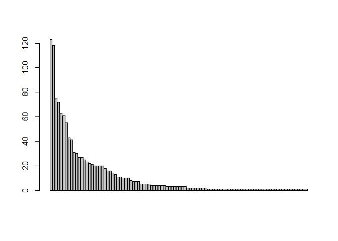

##1.加载需要的包

```r
library(XML)
```

```
## Warning: package 'XML' was built under R version 3.2.3
```

```r
library(dplyr)
```

```
## 
## Attaching package: 'dplyr'
```

```
## The following objects are masked from 'package:stats':
## 
##     filter, lag
```

```
## The following objects are masked from 'package:base':
## 
##     intersect, setdiff, setequal, union
```
##2.得到url

```r
url<-NULL
for(i in 1:29){
  url[i]<-paste0("http://www.youku.com/v_olist/c_97_g__a_%E5%A4%A7%E9%99%86_sg__mt__lg__q__s_1_r_0_u_0_pt_0_av_0_ag_0_sg__pr__h__d_4_p_",i,".html")
}
```

##3.获取单页data

```r
getyouku<-function(URL){
  Sys.sleep(runif(1,1,2))
  doc<-htmlParse(URL[1],encoding="UTF-8")
  rootNode<-xmlRoot(doc)
##获取电视剧名称 
  title<-xpathSApply(rootNode,"//div[@class='p-meta-title']",xmlValue)
#获取观看人数和评分
  num<-xpathSApply(rootNode,"//span[@class='p-num']",xmlValue)
  score<-xpathSApply(rootNode,"//span[@class='p-rating']",xmlValue)
##电视剧集数
  status<-xpathSApply(rootNode,"//span[@class='p-status']",xmlValue)
##合并成数据框
  data<-data.frame(title=title,num=num,score=score,status=status)
  data
}
```

##4.合并

```r
data<-NULL
for(i in 1:29){
  data<-rbind(data,getyouku(url[i]))
}
```

##5.简单分析

```r
data$num<-as.character(data$num)
data$score<-as.numeric(as.character(data$score))
head(data)
```

```
##              title    num score   status
## 1      花千骨 TV版 35.4亿   9.9   58集全
## 2           琅琊榜 30.3亿   9.9   54集全
## 3 武媚娘传奇 湖... 26.3亿   9.4   96集全
## 4  大汉情缘之云... 24.5亿   9.7   44集全
## 5         古剑奇谭 20.9亿   9.1   52集全
## 6    秦时明月 TV版 18.8亿   9.7 更新至48
```

```r
status1<-as.data.frame(table(data$status))
status1<-status1 %>% arrange(-Freq) %>% rename("集数"=Var1,"频率"=Freq)
barplot(status1$频率)
```

\
