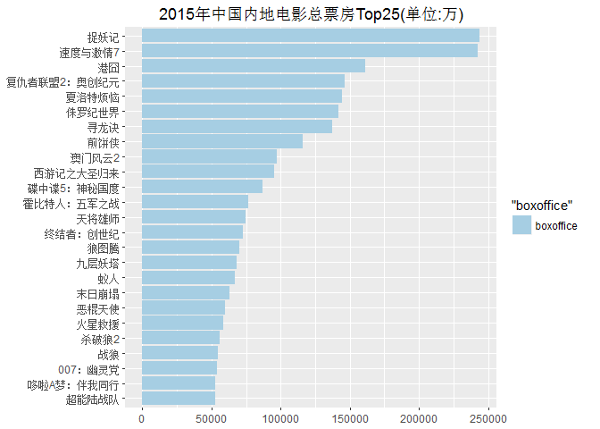
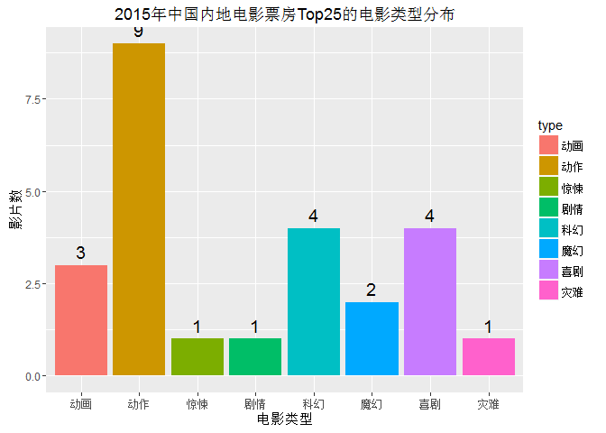

#2015中国票房Top25
注：本文由雪晴数据网负责编辑。原文链接http://www.xueqing.cc/cms/article/115

##1.加载所需要的包

```r
library(XML)
```

```
## Warning: package 'XML' was built under R version 3.2.3
```

```r
library(ggplot2)
```

```
## Warning: package 'ggplot2' was built under R version 3.2.3
```

##2.抓取表格

```r
url<-"http://www.cbooo.cn/year?year=2015"
doc<-htmlParse(url,encoding = "UTF-8")
tables<-readHTMLTable(doc)
table<-tables[[1]]
```

##3.数据清洗

```r
names(table) <- c("title", "type", "boxoffice", "meanprice", "numofpeople", "nation", "date")
boxdf <- as.data.frame(lapply(table, as.character), stringsAsFactors=FALSE)
boxdf[,1] <- sub(pattern="\\d{1,2}.", replacement="", table[,1])
boxdf <- cbind(rank = 1:25,boxdf)
col1 <- c(3,7)
col2 <- 4:6
boxdf[, col1] <- lapply(boxdf[,col1], as.factor)
boxdf[, col2] <- lapply(boxdf[,col2], as.numeric)
```

##4.可视化结果

```r
ggplot(boxdf)+
geom_bar(aes(x=reorder(title, boxoffice), y=boxoffice, fill = "boxoffice"), 
         position = "dodge",stat = "identity")+
   scale_fill_manual(values=c(boxoffice="#A6CEE3")) +
   coord_flip() + labs(x=NULL, y=NULL, title="2015年中国内地电影总票房Top25(单位:万)")
```

\


```r
typedata <- as.data.frame(table(boxdf$type))
names(typedata) <- c("type","number")
ggplot(typedata, aes(x=type, y =number, fill=type))+
geom_bar(position="dodge", stat="identity")+
geom_text(aes(label=number), hjust=0.5, vjust=-0.5, size=5) + 
labs(x="电影类型",y="影片数", title="2015年中国内地电影票房Top25的电影类型分布")
```

\
   


